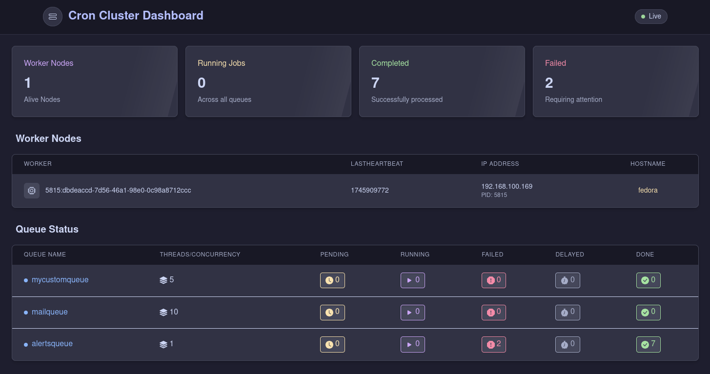
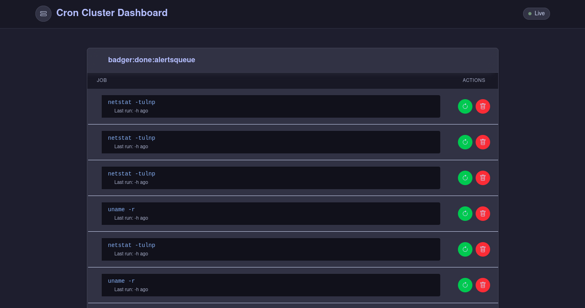
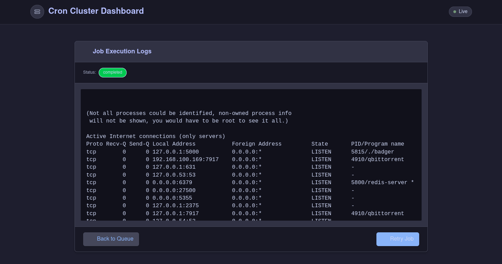

# 🦡 BadgerWorker

A powerful, distributed cron worker implementation in Go that uses Redis for job queuing and locking. Perfect for environments where multiple instances need to coordinate task execution without conflicts.

You can run multiple workers on the same host or across different hosts.

Inspired by [brooce](https://github.com/SergeyTsalkov/brooce).

## 📋 Table of Contents

- [Features](#-features)
- [Installation](#-installation)
- [Configuration](#-configuration)
- [Usage](#-usage)
  - [Basic Usage](#basic-usage)
  - [Adding Custom Queues](#adding-custom-queues)
  - [Running Multiple Workers](#running-multiple-workers)
  - [CLI Options](#cli-options)
- [Web UI](#-web-ui)
  - [Key Web UI Features](#key-web-ui-features)
- [License](#-license)

## 🚀 Features

- **Simple config-driven setup** – Minimal CLI flags, just a config file and optional daemon mode.
- **Distributed concurrency** – Multiple workers handle jobs cooperatively.
- **Redis-powered** – Uses Redis for queueing and distributed locking.
- **Daemon mode** – Run the worker in the background with the `-d` flag.
- **Web UI** – Monitor and manage jobs through a browser-based interface.

## 📦 Installation

Clone the repository and build the binary:

```sh
git clone https://github.com/petreleven/badger.git
cd badger
go build -o badger badger.go
```

## ⚙️ Configuration

The worker is configured via a JSON file located at `/home/.badger/config.json`. This file is automatically generated when you first run the worker.

> **Important:** On first run, the worker will attempt to connect to Redis on the default port (6379). It's OK if this fails - the config file will still be generated, and you can then customize it.

Here's an example of the config file:

```json
{
  "LogFileName": "badger-33920:3f93b037-924b-451c-abc1-9766e1d2b923.log",
  "PidFileName": "badger-33920:3f93b037-924b-451c-abc1-9766e1d2b923.pid",
  "ClusterName": "badger:allworkers",
  "CustomQueues": {
    "Queues": {
      "your-new-queue": {        // Add your queue name here
        "Concurrency": 3,        // Number of parallel jobs
        "Timeout": 120,          // Seconds until job is considered failed
        "DoneLog": true          // Whether to log completed jobs
      },
      "another-queue": {         // You can add multiple queues
        "Concurrency": 5,
        "Timeout": 60
      }
    }
  },
  "RedisURL": "redis://localhost:6379"  // Update Redis URL if needed
}
```

### ✏️ Customize Your Queues

Update the `CustomQueues` section to define your own queues. Each queue must have:

- A unique name (e.g., "mailqueue", "alertsqueue")
- `Concurrency`: number of parallel workers for that queue
- `Timeout`: how long to wait before considering the job failed (in seconds)
- `DoneLog` (optional): set to `true` to log completed jobs

The worker processes jobs as shell commands, making it versatile for various automation tasks.

## 🧠 Usage

### Basic Usage

1. **Run the worker for the first time** to generate the default config file:

```sh
./badger
```

> **Note:** The worker may fail on first run if Redis isn't running on port 6379 - this is expected! The important part is that it will generate the default config file at `/home/.badger/config.json`.

2. **Stop the worker** if it's still running (press Ctrl+C).

3. **Edit the generated config file** at `/home/.badger/config.json`:
   - Update the Redis URL if needed
   - Configure your custom queues (see next section)

4. **Ensure Redis is running** and accessible at the URL you specified.

5. **Start the worker again**:

```sh
./badger
```

Or run it as a background daemon:

```sh
./badger -d
```

The worker will now start processing jobs from the queues defined in your config file.

### Adding Custom Queues

1. **Open the configuration file** at `/home/.badger/config.json`.

2. **Locate the "CustomQueues" section** and add your queue under the "Queues" object:

```json
{
  "LogFileName": "badger-33920:3f93b037-924b-451c-abc1-9766e1d2b923.log",
  "PidFileName": "badger-33920:3f93b037-924b-451c-abc1-9766e1d2b923.pid",
  "ClusterName": "badger:allworkers",
  "CustomQueues": {
    "Queues": {
      "your-new-queue": {        // Add your queue name here
        "Concurrency": 3,        // Number of parallel jobs
        "Timeout": 120,          // Seconds until job is considered failed
        "DoneLog": true          // Whether to log completed jobs
      },
      "another-queue": {         // You can add multiple queues
        "Concurrency": 5,
        "Timeout": 60
      }
    }
  },
  "RedisURL": "redis://localhost:6379"  // Update Redis URL if needed
}
```

3. **Save the config file** and restart your worker:

```sh
./badger
```

4. Your new queue is now ready to receive and process jobs!

### Running Multiple Workers

You can run multiple worker instances to handle more jobs in parallel:

**Same Host:**

Run multiple instances with different process IDs:

```sh
# Terminal 1
./badger

# Terminal 2
./badger

# Terminal 3 - run as daemon
./badger -d
```

**Different Hosts:**

1. Make sure all hosts can access the same Redis server.
2. Configure each worker to use the same Redis URL.
3. Run the worker on each host:

```sh
./badger
```

The workers will automatically coordinate through Redis, distributing jobs across all running instances.

### CLI Options

```sh
Usage of ./badger:
  -d    Run as a daemon in the background
```

## 🖥️ Web UI

BadgerWorker comes with a built-in web interface that runs on port 5000, accessible at `http://localhost:5000`. The Web UI provides a convenient way to:

- **Monitor active jobs** - See what's currently running across all queues
- **View job history** - Check completed, failed, and delayed jobs
- **Manage queues** - Pause, resume, and inspect individual queues
- **Schedule new jobs** - Add jobs directly through the interface
- **Check worker status** - View health metrics and configuration details





### Key Web UI Features

- **Queue Overview**: See at-a-glance statistics for all your configured queues
- **Job Logs**: Access detailed logs for jobs with `DoneLog: true` in their queue configuration
- **Job Control**: Retry failed jobs, cancel running jobs, or delete pending jobs
- **Search**: Find specific jobs by command, status, or queue

Access the web interface by navigating to:
```
http://localhost:5000
```

## 📝 License

[MIT License](LICENSE)
